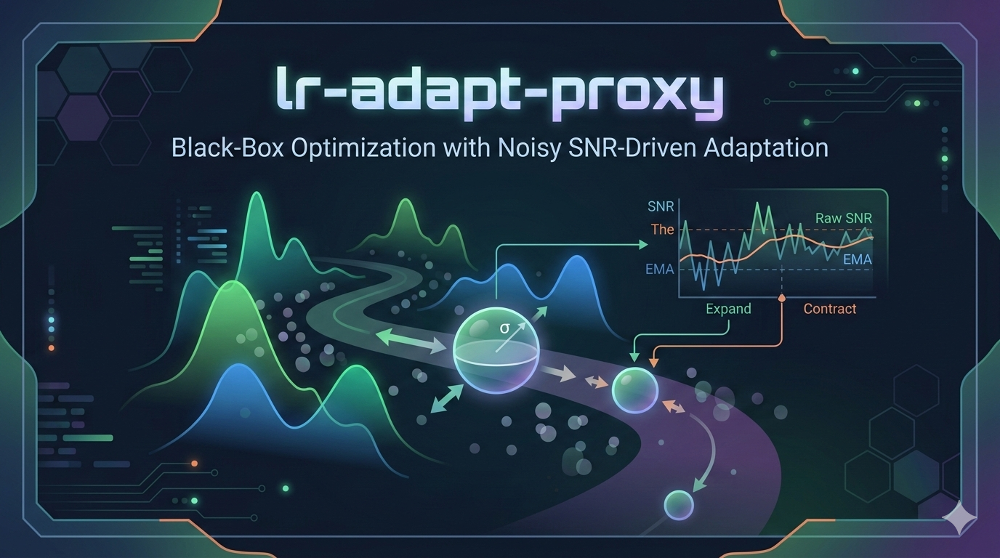

---
# lr-adapt-proxy

## Overview
This project studies black-box optimization under noisy benchmark conditions, where an optimizer must improve objective values even when individual evaluations can be misleading. In this setting, CMA-ES can be viewed as an iterative search procedure: each generation proposes a batch of candidate solutions, evaluates them, and updates its internal search behavior based on the observed outcomes.

One key control variable in CMA-ES is step size (`sigma`), which governs how far new candidates are sampled from the current search center. Larger `sigma` favors broader exploration, while smaller `sigma` favors local refinement. In noisy settings, deciding when to expand or contract this sampling radius can be difficult, because apparent progress can be either real signal or random fluctuation.

`lr_adapt_proxy` in this repository is a practical, repository-local control layer that adjusts `sigma` using observed progress relative to observed noise. At a high level, each generation computes a progress-to-noise ratio (SNR), smooths that value over time with EMA (exponential moving average), and then nudges `sigma` up or down within configured bounds. This is intended to make step-size behavior more responsive to empirical search conditions without replacing the optimizer's core update loop.

This algorithm is intentionally labeled a proxy: it is not presented as an exact reproduction of external LR-Adapt algorithms, and it augments pycma behavior rather than replacing covariance adaptation internals.

Derivation and design rationale: the goal is not to invent a brand-new optimizer, but to add a clear, auditable, noise-aware control loop around step size. The mechanism uses generation-level best improvement as signal, robust MAD of current-generation fitness as noise estimate, EMA smoothing, thresholded multiplicative updates, and clamp bounds relative to initial sigma.

Relation to prior work: the proxy is inspired by the signal-to-noise adaptation philosophy in Nomura, Akimoto and Ono's LRA-CMA-ES (arXiv:2304.03473; extended arXiv:2401.15876), but this implementation is deliberately lightweight and external. It operates after pycma `tell` and only mutates `es.sigma`.

Current implementation architecture:
- Canonical implementation is policy + adapter: policy decides, adapter mutates optimizer state.
- Policy logic lives in `experiments/adaptation/policies/lr_proxy.py` (`LRProxyPolicy`).
- Optimizer mutation lives in `experiments/adaptation/clients/pycma_sigma.py` (`apply_sigma_action`).
- `experiments/lr_adapt_proxy.py` is retained as a compatibility shim that delegates to the policy/adapter flow.
- Runner wiring in `experiments/methods.py` builds an `AdaptationContext`, calls policy `step`, then applies the returned action.
- `proxy_*` diagnostics naming is intentionally retained as v1 compatibility debt for schema continuity.

---

## 1. Scope and Claim Boundaries
This document is the canonical technical specification for the repository-local `lr_adapt_proxy` algorithm and associated pipeline contracts.

Boundary conditions:
- `lr_adapt_proxy` is a transparent repository-local proxy algorithm.
- It is not claimed as an exact reproduction of Nomura et al. or any external LR-Adapt implementation.
- Claims in this document are scoped to repository artifacts and run configurations cited here.
- No universal optimizer claim is made; current evidence is mechanism-level and benchmark-scoped.

---

## 2. Baseline Context (Vanilla CMA-ES vs Proxy Add-on)
`vanilla_cma` uses pycma's standard `ask`/`tell` adaptation loop. In this repository, `lr_adapt_proxy` adds one post-`tell` control signal:
- It reads current-generation fitness values.
- It computes an SNR-like progress statistic.
- It smooths that statistic with EMA.
- It applies multiplicative up/down adjustment to `es.sigma`, with clamp bounds tied to initial sigma.

What changes:
- Directly modified variable: `es.sigma` only.

What does not directly change:
- No direct replacement of covariance update equations.
- Mean/covariance internal pycma updates still run through `tell`.

---

## 3. Formal Definition (Math View of the Implemented Rule)
For minimization, generation fitness vector `f_t`:

- `b_t = min(f_t)` (current generation best)
- `b*_t` = running best-so-far up to generation `t`
- `signal_t = max(b*_{t-1} - b_t, 0)`
- `noise_t = 1.4826 * MAD(f_t) + eps`, with `eps = 1e-12`
- `snr_t = signal_t / noise_t`
- `ema_t = alpha * snr_t + (1 - alpha) * ema_{t-1}`

Sigma factor:
- if `ema_t < tau_down`: `factor_t = k_down`
- else if `ema_t > tau_up`: `factor_t = k_up`
- else: `factor_t = 1`

Clamped sigma update:
- `sigma_t' = clip(sigma_t * factor_t, sigma0 * r_min, sigma0 * r_max)`

State update:
- `b*_t = min(b*_{t-1}, b_t)`

Where:
- `alpha = ema_alpha`
- `tau_down = snr_down_threshold`
- `tau_up = snr_up_threshold`
- `k_down = sigma_down_factor`
- `k_up = sigma_up_factor`
- `r_min = sigma_min_ratio`
- `r_max = sigma_max_ratio`
- `sigma0 = initial_sigma`

---

## 4. Implementation Snippet
Canonical policy rule excerpt from `experiments/adaptation/policies/lr_proxy.py`:

```python
@dataclass(frozen=True)
class LRProxyParams:
    ema_alpha: float
    snr_up_threshold: float
    snr_down_threshold: float
    sigma_up_factor: float
    sigma_down_factor: float
    sigma_min_ratio: float
    sigma_max_ratio: float

def robust_spread(values: np.ndarray) -> float:
    med = np.median(values)
    mad = np.median(np.abs(values - med))
    return float(1.4826 * mad + 1e-12)


class LRProxyPolicy:
    def step(self, context: AdaptationContext) -> AdaptationStep:
        fitness = np.asarray(context.fitness, dtype=float)
        current_best = float(np.min(fitness))
        prev_best = current_best if self.best_so_far is None else float(self.best_so_far)

        signal = max(prev_best - current_best, 0.0)
        noise = robust_spread(fitness)
        snr = signal / noise

        alpha = self.params.ema_alpha
        self.ema_snr = alpha * snr + (1.0 - alpha) * self.ema_snr

        factor = 1.0
        if self.ema_snr < self.params.snr_down_threshold:
            factor = self.params.sigma_down_factor
        elif self.ema_snr > self.params.snr_up_threshold:
            factor = self.params.sigma_up_factor
        ...
        return AdaptationStep(...)
```

Adapter application excerpt from `experiments/adaptation/clients/pycma_sigma.py`:

```python
def apply_sigma_action(es, action: AdaptationAction) -> float:
    es.sigma = float(action.next_value)
    return float(es.sigma)
```

Compatibility shim excerpt from `experiments/lr_adapt_proxy.py` (legacy interface retained):

```python
def apply_lr_adapt_proxy(es, fitness, state, params) -> dict[str, float]:
    policy = LRProxyPolicy(...)
    step = policy.step(AdaptationContext(...))
    apply_sigma_action(es, step.action)
    state.ema_snr = policy.ema_snr
    state.best_so_far = policy.best_so_far
    return step.diagnostics
```
---
## 5. Implementation Mapping
Code mapping for the equations and snippet above:

| Spec Item | Implementation Location |
|---|---|
| Parameter object (`LRProxyParams`) | `experiments/adaptation/policies/lr_proxy.py:10-30` |
| Robust spread (`1.4826 * MAD + 1e-12`) | `experiments/adaptation/policies/lr_proxy.py:33-36` |
| Policy decision rule (`signal`, `noise`, `snr`, EMA, thresholds, clamp) | `experiments/adaptation/policies/lr_proxy.py:55-102` |
| Optimizer mutation boundary (`es.sigma <- action.next_value`) | `experiments/adaptation/clients/pycma_sigma.py:6-8` |
| Post-`tell` context/action invocation | `experiments/methods.py:117-130` |
| Per-run diagnostics persisted in output rows | `experiments/methods.py:142-143` |
| Compatibility shim delegation path | `experiments/lr_adapt_proxy.py:23-56` |
---
## 6. Parameter Semantics and Defaults
Baseline parameter values are currently aligned in:
- `experiments/config/high_rigor.yaml`
- `experiments/config/eval_only_lr_vs_vanilla.yaml`
- `experiments/config/lr_proxy_sensitivity.yaml`

| Parameter | Meaning | Default |
|---|---|---:|
| `ema_alpha` | EMA smoothing coefficient for SNR | `0.2` |
| `snr_down_threshold` | Low-SNR threshold for sigma decrease | `0.08` |
| `snr_up_threshold` | High-SNR threshold for sigma increase | `0.25` |
| `sigma_down_factor` | Multiplicative sigma decrease factor | `0.90` |
| `sigma_up_factor` | Multiplicative sigma increase factor | `1.03` |
| `sigma_min_ratio` | Lower clamp ratio vs initial sigma | `0.10` |
| `sigma_max_ratio` | Upper clamp ratio vs initial sigma | `10.0` |

Range semantics:
- `sigma_down_factor < 1` shrinks step size when low progress-to-noise.
- `sigma_up_factor > 1` expands step size when high progress-to-noise.
- Clamp ratios prevent unbounded shrink/expansion.
---
## 7. Behavioral Invariants and Edge Cases
Expected invariants:
- `best_so_far` is monotone non-increasing in minimization.
- `es.sigma` after proxy update always satisfies:
  - `sigma_min_ratio * sigma0 <= es.sigma <= sigma_max_ratio * sigma0`
- `factor = 1.0` whenever `ema_snr` stays within threshold band.

Edge cases:
- Near-zero spread:
  - `noise` floor (`+1e-12`) prevents division-by-zero in SNR.
- No new best:
  - `signal = 0` by construction.
- First generation:
  - `prev_best` initializes from current generation best.
---
## 8. Empirical Evidence Summary
All numbers below are copied from tracked artifacts.

### 8.1 High-Rigor Matrix Result
Run: `20260305T085129Z-cac939ce`  
Artifact: `artifacts/runs/high-rigor/20260305T085129Z-cac939ce/results/method_aggregate.csv`

`lr_adapt_proxy` aggregate row:
- `median_of_cell_median_delta = -18.87208878679076`
- `mean_win_rate = 0.505`
- `cells_q_lt_0_05 = 35`
- `best_q_value = 1.2287009464468514e-17`

`pop4x` aggregate row:
- `median_of_cell_median_delta = 58.69544875079048`
- `mean_win_rate = 0.0797222222222222`
- `cells_q_lt_0_05 = 36`

Sign convention for minimization comparisons:
- Negative `median_delta_vs_vanilla` is better than vanilla.

### 8.2 Pairwise (Vanilla vs LR Proxy)
Artifact: `artifacts/runs/high-rigor/20260305T085129Z-cac939ce/results/pairwise_lr_vs_vanilla.json`

Pairwise orientation:
- `method_a = vanilla_cma`
- `method_b = lr_adapt_proxy`
- `median_delta_b_minus_a < 0` means method B (`lr_adapt_proxy`) is better.

Summary:
- `n_cells = 36`
- `n_q_lt_0_05 = 35`
- `n_p_lt_0_05 = 35`
- `n_b_better = 21`
- `n_a_better = 15`
- `median_of_cell_median_delta_b_minus_a = -18.872088786790762`

Interpretation:
- Under this protocol, `lr_adapt_proxy` outperforms vanilla in most cells with broad corrected significance.

### 8.3 Sensitivity Sweep Headline
Run: `20260305T085252Z-1a889aa0`  
Artifact: `artifacts/runs/lr-proxy-sensitivity/20260305T085252Z-1a889aa0/results/sensitivity_summary.csv`

Rows in sweep summary: `9`

Baseline variant (`baseline`):
- `median_of_cell_median_delta = -18.87208878679077`
- `mean_win_rate = 0.505`
- `cells_q_lt_0_05 = 35`

Best median-delta variant (`sigma_clamp_0.05_20.0`):
- `median_of_cell_median_delta = -42.053864412274585`
- `mean_win_rate = 0.6116666666666666`
- `cells_q_lt_0_05 = 30`

Worst median-delta variant (`sigma_clamp_0.2_5.0`):
- `median_of_cell_median_delta = 5.806193522986625`
- `mean_win_rate = 0.2986111111111111`
- `cells_q_lt_0_05 = 31`

Observation:
- Sweep indicates meaningful sensitivity to clamp choices.

### 8.4 Latest Validated Mechanism Sweep (Hybrid Telemetry)
Run: `20260305T111933Z-awf-mechanism`  
Artifacts:
- `artifacts/runs/awf-mechanism/20260305T111933Z-awf-mechanism/results/sensitivity_runs_long.csv`
- `artifacts/runs/awf-mechanism/20260305T111933Z-awf-mechanism/results/awf_hypothesis_checks.json`

Run completion:
- `108000 / 108000` runs with `status = ok`
- Methods: `vanilla_cma`, `lr_adapt_proxy`
- Variants: `15` (12 geometry + 3 threshold-control)

Pre-registered hypothesis status:
- `P1`: not globally supported
- `P2`: supported (not falsified)
- `P3`: supported

P3 model evidence:
- `delta_aic = 1872.7474`
- `delta_bic = 1837.1605`
- `proxy_fraction_at_floor p-value = 2.9167e-92`
- `n_rows_modeled = 54000`

Interpretation docs for this run:
- `docs/exporatory/AWF_MECHANISM_INTERPRETATION_MEMO_2026-03-05.md`
- `docs/exporatory/AWF_MECHANISM_ONE_PAGER_2026-03-05.md`
- `docs/exporatory/PHENOMENON.md`

Note:
- Any threshold/gate values should be treated as provisional pending finalized write-up and replication.
---
## 9. Diagnostics and Observability
`lr_adapt_proxy` emits per-generation diagnostics in return payload:
- `proxy_signal`
- `proxy_noise`
- `proxy_snr`
- `proxy_ema_snr`
- `proxy_sigma_factor`
- `proxy_sigma`
- `proxy_current_best`
- `proxy_best_so_far`

Run-level persisted fields include:
- `proxy_sigma_factor_last`
- `proxy_ema_snr_last`
- `proxy_time_to_first_floor_gen`
- `proxy_fraction_at_floor`
- `proxy_n_floor_entries`
- `proxy_n_floor_exits`
- `proxy_n_down_steps`
- `proxy_n_up_steps`
- `proxy_n_neutral_steps`
- `proxy_sigma_min_seen`
- `proxy_sigma_max_seen`
- `proxy_trace_written`
- `proxy_trace_relpath`

Per-generation trace artifacts:
- Sidecar CSV traces are written under `results/proxy_traces/` when tracing is enabled.
- Latest validated hybrid run wrote `21600` proxy trace files.

Use:
- Track whether proxy is mostly in shrink (`factor < 1`), expand (`factor > 1`), or neutral mode.
- Detect saturation behavior against sigma clamps.
---
## 10. Reproducibility
Minimal command set:

Latest validated run IDs in this session:
- Smoke: `20260305T085008Z-b47c25f9`
- Eval-only: `20260305T085022Z-2f5b6f1b`
- High-rigor: `20260305T085129Z-cac939ce`
- Sensitivity: `20260305T085252Z-1a889aa0`
- AWF mechanism sweep: `20260305T111933Z-awf-mechanism`

1. High-rigor run (includes pairwise by wrapper):
```bash
bash scripts/run_high_rigor_pipeline.sh --workers 8
```

2. Eval-only vanilla-vs-lr comparison:
```bash
bash scripts/run_eval_only_lr_vs_vanilla.sh --workers 8
```

3. Sensitivity sweep:
```bash
bash scripts/run_lr_proxy_sensitivity.sh --workers 8
```

4. Optional smoke pipeline:
```bash
bash scripts/run_smoke_pipeline.sh --workers 8
```

5. AWF mechanism sweep:
```bash
python3 -m experiments.sensitivity \
  --config experiments/config/awf_mechanism_proof.yaml \
  --outdir artifacts/runs/awf-mechanism/<RUN_ID>/results
```

6. AWF post-analysis:
```bash
python3 -m experiments.awf_analysis \
  --runs artifacts/runs/awf-mechanism/<RUN_ID>/results/sensitivity_runs_long.csv \
  --cell-stats artifacts/runs/awf-mechanism/<RUN_ID>/results/sensitivity_cell_stats.csv \
  --summary artifacts/runs/awf-mechanism/<RUN_ID>/results/sensitivity_summary.csv \
  --outdir artifacts/runs/awf-mechanism/<RUN_ID>/results
```

7. Artifact verification (example run IDs from current outputs):
```bash
python3 scripts/verify_rerun_artifacts.py \
  --results-dir artifacts/runs/high-rigor/20260305T085129Z-cac939ce/results \
  --figdir artifacts/runs/high-rigor/20260305T085129Z-cac939ce/figures \
  --config experiments/config/high_rigor.yaml \
  --mode full \
  --require-pairwise

python3 scripts/verify_rerun_artifacts.py \
  --results-dir artifacts/runs/eval-only-lr-vs-vanilla/20260305T085022Z-2f5b6f1b/results \
  --figdir artifacts/runs/eval-only-lr-vs-vanilla/20260305T085022Z-2f5b6f1b/figures \
  --config experiments/config/eval_only_lr_vs_vanilla.yaml \
  --mode eval_only \
  --require-pairwise
```

Pairwise artifacts produced by current wrappers:
- `pairwise_lr_vs_vanilla.csv`
- `pairwise_lr_vs_vanilla.json`
- `findings_pairwise.md`
---
## 11. Limitations and Open Questions
Known limitations:
- Proxy status: this is not an exact external LR-Adapt reproduction.
- Evidence scope: conclusions are tied to current benchmark matrix, seeds, budgets, and pycma configuration.
- Cross-objective scale effects can dominate aggregate magnitude summaries.

Open questions:
- Which proxy components drive gains most strongly (threshold band vs clamp window vs factors)?
- How does proxy behavior transfer beyond current function families and budget regime?
- What additional diagnostics should be logged for generation-level causal analysis (not just final-generation snapshots)?
---
## 12. Maintenance Note
- `docs/analysis/lr_adapt_proxy_technical_spec.md` is the canonical algorithm and pipeline contract document.
- `README.md` intentionally mirrors this document for discoverability.
- When contracts change, update this spec first, then mirror those updates into `README.md`.
